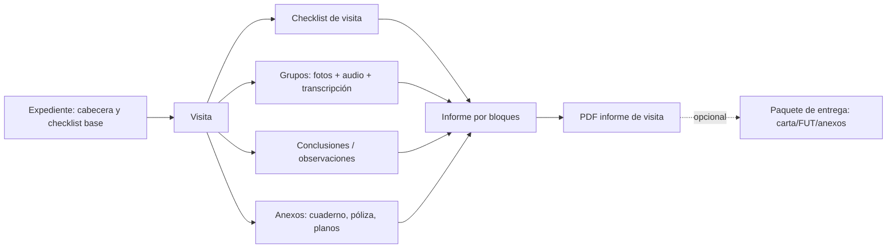

# Análisis de formatos reales — informes de verificación técnica

**Revisado:** 2026-09-17  
**Muestras:** 3 PDFs de Vicky Rosales y 3 libros Excel `.xls` de César Perales. Los archivos fuente permanecen en `~/Descargas/informesmami` y `~/Descargas/informespapi`; no se copiaron al repositorio.

## Conclusión principal

El flujo propuesto es correcto para capturar el trabajo de campo, pero el formato real no se reduce estrictamente a cuatro bloques. Hay un **núcleo común** que sí encaja con el MVP —cabecera, checklist, observaciones, registro fotográfico y firmas— y anexos/documentos de entrega que cambian según municipalidad y expediente.

La aplicación debe separar:

1. **Informe de visita editable:** lo que genera la visita y se edita en bloques.
2. **Paquete de entrega institucional:** opcional; puede añadir carta de remisión, FUT, cuaderno de obra escaneado, póliza u otros anexos al PDF final.

El MVP puede generar primero el informe de visita y dejar el paquete institucional como bloques/anexos opcionales. No se debe intentar llenar automáticamente un FUT municipal todavía.

## Muestra A — Vicky Rosales (PDF)

| Archivo | Páginas | Patrón observado |
|---|---:|---|
| `Informe N°1-Exp 32956-2025.pdf` | 7 | FUT, carta de remisión, cabecera de visita, checklist, observaciones, registro fotográfico y foto de cuaderno de obra. |
| `Informe N°18-Exp-32956-2025.pdf` | 7 | Mismo expediente/plantilla; cambia el responsable temporal, avance y evidencia. |
| `Informe N°6-Exp E-06328-2026.pdf` | 9 | Carta de remisión, cabecera, checklist, observaciones, dos páginas de registro fotográfico, cuaderno de obra y póliza. |

### Secciones recurrentes de Vicky

1. **Entrega institucional opcional:** FUT y carta dirigida a la subgerencia municipal. Contienen expediente, licencia, ubicación, propietario, responsable de obra, número de informe, fecha, datos de contacto y firma del inspector.
2. **Cabecera técnica de visita:** número/código de informe, fecha de inspección, fracción de visita (`6/7`, `18/54`), expediente, licencia/modalidad, vigencia, datos de obra, propietario, responsable de obra, inspector y cronograma.
3. **Checklist de cumplimiento:** al menos dos secciones: exigencia obligatoria en obra y Norma Técnica G.050 (seguridad durante construcción). Tiene checks Sí/No, observación y, en algunos casos, nivel de riesgo.
4. **Observaciones y recomendaciones:** texto numerado; puede incluir solicitudes, estado/avance de partidas, reprogramación y referencias a visitas anteriores. Incluye entrega al residente, asiento de cuaderno de obra, siguiente visita y avance general.
5. **Registro fotográfico:** una o varias páginas, cabecera repetida, composición de imágenes de tamaños distintos y textos asociados a conjuntos de fotos. Esto corresponde directamente a los grupos de captura de la app.
6. **Anexos:** fotografías/escaneos de cuaderno de obra y, en una muestra, póliza de seguro. No son fotos de hallazgo; deben conservarse como adjuntos separados.
7. **Firmas:** inspector y responsable/residente. El pie aparece repetido en las hojas técnicas; la imagen de firma puede estar incluida o reservarse para firma física.

## Muestra B — César Perales (Excel)

Se revisaron los libros `VISITA 01`, `VISITA 04` y `VISITA 09` del expediente 6525-2022. Los tres comparten una plantilla Excel de inspector municipal, con imágenes embebidas y contenido variable por visita. La muestra visual de visita 04 confirma la maquetación por celdas, fotos insertadas, checks y firma/sello.

| Visita | Contenido variable identificado |
|---|---|
| 01 | Etapa de excavaciones/cimentación; constancia de EPP, cuaderno de obra y protección a terceros; primeras observaciones sobre linderos, planos aprobados y otros requisitos. |
| 04 | Etapa de estructuras verticales del primer piso; evidencia por arquitectura/estructuras, sanitaria y eléctrica; observaciones reiteradas desde visitas 1–3; calificación, avance y próxima visita. |
| 09 | Obra paralizada; reitera observaciones de las visitas 1–8 y deja constancia de incumplimientos/variaciones y de la continuidad de trabajo durante la paralización. |

### Secciones recurrentes de César

1. **Datos generales:** expediente, licencia, fecha, propietario, ubicación, tipo y valor de obra, responsable y profesional responsable.
2. **Tipo de obra y trazabilidad:** modalidad/tipo de obra y lista de visitas técnicas anteriores.
3. **Verificación de lo ejecutado:** avance por nivel o partida; contraste entre lo aprobado y lo verificado, con cumplimiento/no cumplimiento y descripción.
4. **Requerimientos verificados:** checklist amplio de seguridad, orden, instalaciones, EPP, señalización, cuaderno de obra, permisos y otras exigencias. Incluye campos de “según proyecto aprobado”, “según lo verificado” y cumplimiento.
5. **Evidencia multimedia por especialidad:** fotos y texto para arquitectura/estructuras, instalaciones sanitarias e instalaciones eléctricas.
6. **Conclusiones y observaciones:** lista de observaciones acumulables y reiterables entre visitas; algunas hacen referencia explícita a visitas 1–3 u 1–8.
7. **Calificación:** conforme/observado, avance general, próxima visita y declaración del propietario/responsable de subsanar observaciones.
8. **Firmas y sello:** inspector municipal y responsable de obra/propietario; la firma se repite como parte del formato de cada hoja.

## Implicaciones para el producto y la BD

| Necesidad observada | Decisión de producto/modelo |
|---|---|
| El mismo expediente mantiene checklist entre visitas | El expediente guarda una copia JSON personalizable y cada visita vuelve a copiar el esquema vigente al ser creada. |
| Los formatos municipales son distintos | La plantilla versionada define secciones/campos/renderizado. No hardcodear G.050 como única forma. |
| Responsable de obra puede cambiar | Guardar participantes/responsables con snapshot por visita/informe; no depender solo de un campo fijo de expediente. |
| Observaciones se repiten o se levantan con el tiempo | Conservar texto por visita ahora; una fase posterior puede modelar observaciones rastreables. |
| Fotos con varias composiciones en una hoja | El bloque de grupo multimedia necesita layout editable; el PDF calcula distribución conservando proporción. |
| Cuaderno, póliza, planos y otros escaneos | `Adjunto` puede pertenecer al expediente o a una visita; no se mezcla con `Foto` de captura. |
| Carta/FUT son documentos de remisión | Tratarlos como paquete de entrega opcional, fuera del núcleo de captura MVP. |
| Firmas de dos roles por página | Configurar firmantes requeridos por plantilla/formato y repetir el pie en el renderizador. |

## Mapeo del MVP a los formatos

## Regla de alcance para la demo

Para la primera demo: una plantilla de expediente que incluya cabecera, checklist, observaciones/conclusiones, grupos fotográficos y dos firmantes. Permitir adjuntar foto de cuaderno de obra y firmas. La carta/FUT y una composición idéntica a Excel se presentan como siguiente iteración, no como condición para probar el ahorro de tiempo de captura a informe.
