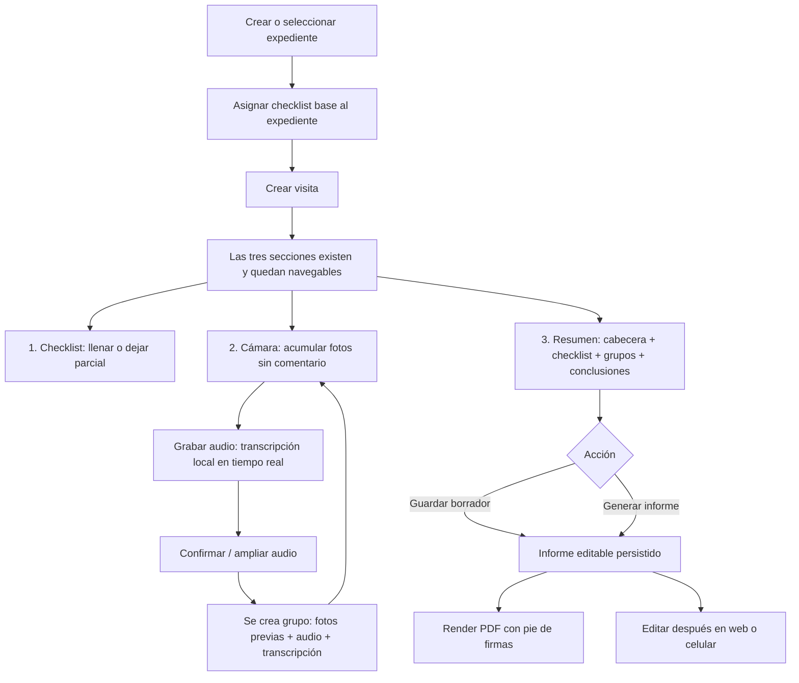

# Contexto operativo — Demo de informes de visita

**Actualizado:** 2026-09-17  
**Estado:** diseño de demo/MVP; no es aún una especificación de producción.

## Problema que la demo debe evidenciar

El ICP inicial no es “cualquier arquitecto”, sino inspectores de obra, delegados CAP, peritos y supervisores que elaboran informes frecuentes sin una herramienta de campo adecuada. La evidencia más fuerte es Vicky Rosales: una visita toma 30 minutos a 2 horas, pero ordenar hasta ~100 fotos, transcribir apuntes, redactar y maquetar el informe en Excel/Word toma 4–5 horas. El contexto se pierde si el informe no se hace el mismo día.

La solución no debe venderse como “tomar fotos”: Report and Run ya cubre una parte de ese caso para algunos supervisores. La propuesta de valor demostrable es conservar el contexto desde obra, reducir el gabinete y llenar un formato peruano listo para editar/imprimir: fotos agrupadas por hallazgo, dictado transcrito, checklist y cabecera automática. A futuro puede sumar RNE/RAG y formatos institucionales.

La intensidad del dolor es segmentada: Vicky (4–5h, Excel) es el ICP; Laura (usa Report and Run) conserva un dolor moderado de ~3h para fotos; Israel es un outlier eficiente (~1h). No generalizar la conclusión a proyectistas senior ni a todo arquitecto.

Los formatos reales revisados están documentados en [[Analisis de Formatos Reales de Informes]]. El informe de visita tiene un núcleo común, pero puede acompañarse de carta/FUT y anexos institucionales; estos últimos no deben confundirse con el contenido capturado en campo.

## Flujo exacto de la demo

### 0. Configurar el expediente una sola vez

El arquitecto crea o abre un **expediente**. Contiene los datos de cabecera que se repiten en todos sus informes de visita: número de expediente/licencia, propietario, ubicación, tipo de obra y demás datos estables.

Al crearlo, escoge una **plantilla de checklist** del catálogo. La aplicación copia su nombre y esquema JSON dentro del expediente y no conserva un enlace con la plantilla original. El arquitecto puede agregar, quitar o modificar campos para ese expediente sin afectar el catálogo ni otros expedientes. Al crear una visita, se vuelve a copiar el esquema que el expediente tenga en ese momento, junto con una instancia vacía de respuestas.

### 1. Crear e iniciar una visita

Una visita representa una inspección y engloba exactamente un informe editable. Al crearla o pulsar “empezar visita”, se abre el modo de captura con tres secciones permanentes. No son pasos obligatoriamente secuenciales: el arquitecto puede volver a cualquiera durante toda la visita.

| Sección | Propósito | Estado al crear la visita |
|---|---|---|
| 1. Checklist | Completar el formulario base de la visita | Instancia vacía creada desde el checklist del expediente |
| 2. Cámara y transcriptor | Capturar fotos y convertir comentarios de voz en grupos | Lista de fotos pendientes vacía |
| 3. Resumen y conclusiones | Revisar todos los datos antes de guardar/generar | Vive desde el inicio y se actualiza con los datos disponibles |

La app abre inicialmente la sección 1 por conveniencia, pero no bloquea tomar fotos si el checklist está incompleto.

### 2. Sección checklist

El profesional llena el formulario básico (checks, observaciones y datos propios de la visita). Puede dejarlo parcialmente completado, cambiar a cámara y regresar después. Las respuestas quedan en `Visita.checklist_respuestas_json`; no modifican la plantilla ni los valores de otras visitas.

### 3. Sección cámara y transcriptor

Las fotos se acumulan visualmente como una pila/lista de **fotos pendientes**. Todavía no son un grupo mientras no haya comentario.

Cuando el profesional pulsa grabar comentario:

1. El audio se conserva como evidencia original.
2. La voz se transcribe en el dispositivo, de forma local y en tiempo real; el usuario ve texto mientras habla.
3. Al detener la grabación aparece una confirmación breve (aprox. cinco segundos), con check y opción de ampliar/continuar el audio. No es una acción para borrar el grupo.
4. Al confirmar, todas las fotos pendientes anteriores pasan a un `Grupo_Captura` junto con el audio y su transcripción. El grupo aparece en la sección 3.
5. La pantalla se mantiene en cámara, con una nueva lista de fotos pendientes, para continuar sin fricción.

Por tanto, el **audio delimita** cada grupo. La agrupación por similitud ocurre después y solo dentro de ese grupo, para sugerir tomas casi repetidas; nunca debe eliminar fotos ni cambiar su pertenencia automáticamente.

### 4. Sección resumen y conclusiones

La tercera sección muestra un resumen integral y navegable incluso antes de finalizar:

- Cabecera heredada del expediente y datos de la visita.
- Preview compacto del checklist, incluyendo pendientes si los hubiera.
- Grupos en el orden de captura: fotos seleccionables, comentario transcrito y audio reproducible.
- Conclusiones de visita: texto directo o audio con transcripción. Estas pueden completarse en obra o después, desde casa.

Al pulsar “finalizar toma de datos” la app lleva al resumen, pero no bloquea volver a checklist o cámara.

### 5. Guardar, editar y emitir

Los botones **Guardar como borrador** y **Generar informe** persisten el mismo documento editable; el segundo además produce una exportación PDF. No existe un documento irreversible al generar: se puede abrir la visita luego desde navegador o celular, editar sus bloques y volver a exportar.

El editor de gabinete se parece a un Colab: bloques ordenables/editables de cabecera, checklist, grupos multimedia, conclusiones y firmas. La plataforma arma inicialmente el flujo, pero el usuario puede ajustar el contenido. El motor PDF decide la disposición óptima de las fotos seleccionadas por grupo, preservando proporción y calidad. El PDF lleva el estilo/marca de la plataforma y deja en cada página el pie con espacios para firma del residente de obra y del inspector IMO; se puede adjuntar después una foto de cada firma o imprimir para firmar físicamente.

## Distinciones de dominio que no se deben mezclar

| Concepto | Qué es | Qué no es |
|---|---|---|
| Profesional | Cuenta/usuario arquitecto que usa la plataforma y es dueño de sus expedientes | Cualquier persona que firma un informe |
| Expediente | Caso/obra persistente con datos repetidos de cabecera | Una plantilla ni un informe |
| Visita | Una inspección fechada dentro del expediente | El expediente completo |
| Plantilla de checklist | Definición versionada de un formulario | El checklist llenado |
| Checklist del expediente | Copia JSON independiente y editable guardada en `Expediente.checklist_esquema_json` | Una referencia viva al catálogo |
| Respuestas del checklist | JSONB dentro de `Visita`, creado vacío desde la plantilla del expediente | Una plantilla reutilizable |
| Grupo de captura | Fotos tomadas antes de un comentario de voz; el audio delimita el grupo | El bloque visual del informe, aunque puede originarlo |
| Conclusiones de visita | Texto y/o audio final propios de una visita | Un comentario de un grupo de fotos |
| Adjunto de visita | Cuaderno de obra, póliza, plano u otro documento soporte | Una foto de hallazgo dentro de un grupo |
| Informe | Documento editable 1:1 guardado dentro de `Visita.documento_json` | Una entidad adicional separada de la visita |
| Bloque de informe | Elemento del state-tree JSON (cabecera, checklist, grupo, conclusión, adjunto o firmas) | La fuente de verdad de fotos, audio o respuestas |

## Decisiones de modelo

- `Plantilla_Checklist` funciona solo como catálogo. Al seleccionarla, el expediente duplica el JSON y queda completamente desconectado; puede personalizarlo libremente.
- Cada visita copia `Expediente.checklist_esquema_json` a `Visita.checklist_esquema_json`. Sus respuestas viven en `Visita.checklist_respuestas_json`, por lo que una modificación posterior del expediente no altera visitas existentes.
- `Archivo` centraliza metadatos de almacenamiento. Fotos, audios y firmas no deben depender solo de una URL; se requiere clave de storage, MIME, tamaño, hash y estado de sincronización para soportar el modo offline.
- Durante captura, una foto puede estar pendiente y sin grupo. Al confirmar el comentario, todas las fotos pendientes pasan al grupo creado por ese audio. Si quedan fotos pendientes al finalizar, la UI debe pedir que se les grabe un comentario o que se confirme explícitamente un grupo sin comentario; no debe perderlas.
- `Foto.hash_perceptual` se usa solamente para sugerir duplicados/similitud. `hash_contenido` sirve para detectar el mismo archivo.
- El informe nace junto con la visita como `documento_json`. Guarda la lista ordenada de bloques y snapshots/overrides editables sin requerir tablas `Informe` y `Bloque_Informe` para una relación que siempre es 1:1.
- Una firma es una persona que debe aparecer en el informe, no necesariamente una cuenta. Puede tener imagen de firma o quedar sin imagen para imprimir y firmar a mano. Se pueden registrar 2, 3 o más firmantes.

## Alcance de la demo de esta semana

Debe probar la fricción, no resolver todavía IA normativa, colaboración multiusuario, un editor de plantillas completo ni exportación institucional perfecta. Para la visita de prueba de los padres, medir: número de fotos tomadas/seleccionadas, duración de audio, tiempo hasta tener el informe borrador y minutos de edición posterior. Pedirles comparar ese tiempo con su proceso habitual de Word/Excel.

## Evidencia del repositorio utilizada

- `4. Entrevistas y Validacion/Sintesis Cruzada - Batch Entrevistas.md`
- `4. Entrevistas y Validacion/Entrevista - Vicky Rosales.md`
- `4. Entrevistas y Validacion/Entrevista - Laura Rojas.md`
- `3. Perfiles de Usuario/Journey Maps/Journey - Inspector IMO y Supervisor.md`
- `2. Problemas/Redaccion Mecanica de Actas (Inspectores y Delegados).md`

Los informes de ejemplo se revisaron desde `~/Descargas/informesmami` y `~/Descargas/informespapi`; sus hallazgos y el contraste de campos están consolidados en [[Analisis de Formatos Reales de Informes]]. Los binarios fuente no se copiaron al repositorio.
