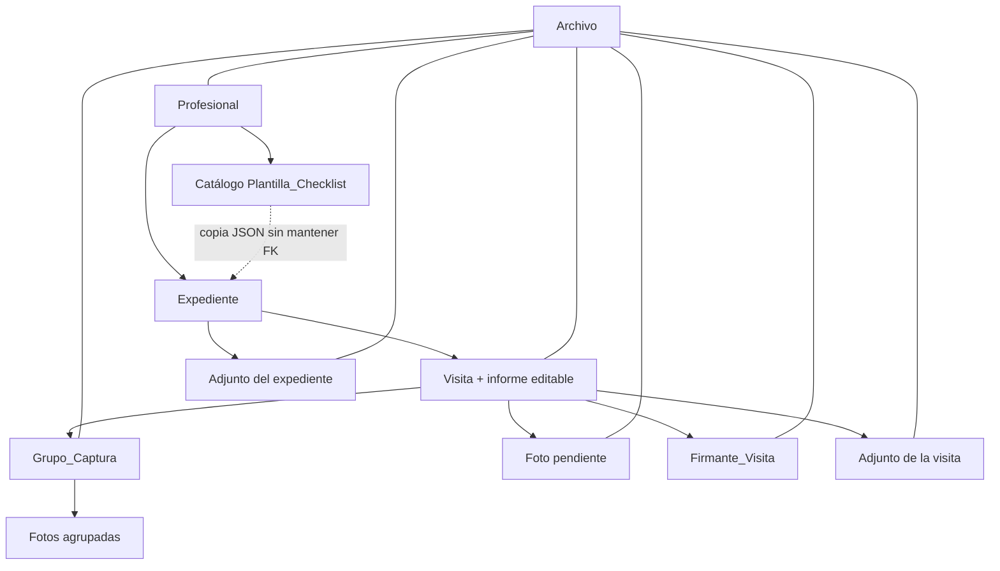

# Diseño simplificado de base de datos — informes de visita

**Actualizado:** 2026-09-17  
**Objetivo:** cubrir el flujo completo de la demo sin modelar como tablas separadas relaciones que siempre son 1:1.

## Jerarquía



La jerarquía funcional principal es:

```text
Profesional
└── Expediente ── copia editable del checklist seleccionado
    ├── Adjuntos reutilizables (póliza, planos)
    └── Visita = captura + checklist respondido + informe editable
        ├── Grupos de captura
        │   └── Fotos
        ├── Firmantes
        └── Adjuntos propios (cuaderno de obra, acta)
```

## Las nueve tablas

| Tabla | Responsabilidad |
|---|---|
| `Profesional` | Cuenta del arquitecto/inspector. Es dueño de expedientes y archivos; puede guardar una firma predeterminada. |
| `Archivo` | Metadatos comunes de todo binario: foto, audio, firma, documento o PDF. Soporta estado local y sincronización con la nube. |
| `Plantilla_Checklist` | Catálogo de formularios de partida. Se consulta para copiar un esquema, pero no queda enlazado al expediente. |
| `Expediente` | Caso/obra con la cabecera común y una copia JSON editable de su checklist. |
| `Visita` | Inspección concreta. Copia el checklist vigente del expediente y contiene respuestas, conclusiones e informe editable. |
| `Grupo_Captura` | Comentario de voz que delimita un conjunto de fotos; conserva audio, transcripción original y texto corregido. |
| `Foto` | Foto capturada en una visita. Puede estar pendiente (`grupo_captura_id = null`) o pertenecer a un grupo confirmado. |
| `Firmante_Visita` | Persona que aparece en el pie del informe, con firma digital opcional o espacio para firma física. |
| `Adjunto` | Póliza, plano, cuaderno de obra, acta u otro soporte; puede ser general del expediente o específico de una visita. |

## Por qué se eliminaron tablas

| Tabla anterior | Simplificación |
|---|---|
| `Plantilla_Checklist_Version` | La versión vive en `Plantilla_Checklist`; cada nueva versión es otra fila. |
| `Expediente_Checklist` | El alcance actual usa un checklist por expediente; el esquema copiado vive directamente en `Expediente`. |
| `Visita_Checklist` | Existe exactamente una instancia por visita; las respuestas viven en `Visita.checklist_respuestas_json`. |
| `Conclusiones_Visita` | Existe exactamente una por visita; texto, transcripción y audio viven en `Visita`. |
| `Informe` | Existe exactamente uno por visita; estado, versión, PDF y documento editable viven en `Visita`. |
| `Bloque_Informe` | Los bloques se editan y reordenan juntos, por lo que son un state-tree en `Visita.documento_json`. |
| `Visita_Participante` | Para el MVP basta el responsable de obra en la visita y la colección de firmantes. |
| `Exportacion_Informe` | El MVP conserva el último PDF generado en `Visita.pdf_archivo_id`; historial de exportaciones puede añadirse cuando exista esa necesidad. |

## Contenido del documento editable

`Visita.documento_json` no duplica los archivos. Guarda el orden, las referencias y los cambios visuales del editor:

```json
{
  "schema_version": 1,
  "cabecera_snapshot": {
    "nro_expediente": "E-06328-2026",
    "propietario": "CENCOSUD PERU SHOPPING S.A.C.",
    "ubicacion": "..."
  },
  "bloques": [
    { "id": "b1", "tipo": "CABECERA" },
    { "id": "b2", "tipo": "CHECKLIST" },
    { "id": "b3", "tipo": "GRUPO", "grupo_captura_id": "...", "foto_ids": ["...", "..."] },
    { "id": "b4", "tipo": "CONCLUSIONES" },
    { "id": "b5", "tipo": "ADJUNTO", "adjunto_id": "..." },
    { "id": "b6", "tipo": "FIRMAS" }
  ]
}
```

Las fotos, audios y adjuntos siguen siendo registros normales. El JSON indica cómo mostrarlos; no es su fuente de almacenamiento.

## Cobertura del flujo

### 1. Crear o seleccionar expediente

Se crea `Expediente` con cabecera estable y se selecciona una fila del catálogo `Plantilla_Checklist`. La aplicación copia `nombre` y `esquema_json` a `Expediente.checklist_nombre` y `Expediente.checklist_esquema_json`. No guarda el ID de la plantilla elegida.

A partir de ahí, el checklist del expediente es independiente: se pueden añadir, eliminar o modificar campos antes de iniciar visitas sin alterar la plantilla de catálogo.

Los planos o pólizas reutilizables se agregan como `Adjunto` con `visita_id = null`.

### Campos de cabecera contrastados con los informes reales

Los ejemplos de Vicky y César quedan cubiertos así:

| Información observada | Ubicación en el modelo |
|---|---|
| Expediente, licencia, modalidad y entidad/municipalidad | `Expediente` |
| Emisión y vencimiento/vigencia de licencia | `fecha_emision_licencia`, `vigencia_desde`, `vigencia_hasta` |
| Propietario, dirección, tipo/uso/detalle y valor de obra | `Expediente` |
| Responsable de obra y colegiatura | Predeterminado en `Expediente`, con override en `Visita` si cambia |
| Póliza CAR, compañía y vigencia | `poliza_car_json` y archivo opcional en `Adjunto` |
| Campos municipales variables, zonificación, lote, sector o cronograma | `datos_cabecera_extra` |
| Número/fracción de visita y total programado | `Visita.nro_visita` + `Expediente.total_visitas_programadas` |
| Código impreso del informe | `Visita.codigo_informe` |
| Avance, riesgo y conforme/observado | `avance_general`, `nivel_riesgo`, `calificacion` |
| Entrega al residente, asiento y próxima visita | Campos correspondientes de `Visita` |
| Inspector y datos de contacto/colegiatura | `Profesional` |
| Firmas del inspector y responsable/residente | `Firmante_Visita` |

Los detalles que cambian según municipalidad permanecen en JSONB para no convertir cada casilla de un formato particular en una columna global.

### 2. Crear visita

Se crea `Visita` copiando `checklist_nombre` y `checklist_esquema_json` desde el expediente. Así, si luego se personaliza nuevamente el checklist del expediente, una visita histórica conserva exactamente la estructura con la que fue llenada.

También se inicializan:

- `checklist_respuestas_json` vacío.
- `documento_json` con cabecera, checklist, conclusiones y firmas.
- Dos `Firmante_Visita` predeterminados si corresponde: inspector y responsable/residente.

### 3. Navegar por las tres secciones

Las secciones no necesitan tablas propias. Son tres vistas sobre la misma visita:

- Checklist: lee `Visita.checklist_esquema_json` y escribe en `Visita.checklist_respuestas_json`.
- Cámara: crea `Foto` con `grupo_captura_id = null`.
- Resumen: combina expediente, visita, checklist, grupos, conclusiones, firmantes y adjuntos.

### 4. Grabar y confirmar comentario

Al empezar el audio se crea `Grupo_Captura`. El audio se registra en `Archivo`, mientras la transcripción local se actualiza en `transcripcion_parcial`.

Al confirmar:

1. Se guarda `transcripcion_original`.
2. El grupo pasa a `CONFIRMADO`.
3. Las fotos pendientes de la visita reciben su `grupo_captura_id` y `orden_en_grupo`.
4. La cámara queda lista para acumular el siguiente conjunto.

El hash perceptual de `Foto` permite sugerir imágenes similares únicamente dentro del grupo.

### 5. Completar resumen y conclusiones

Las conclusiones escritas o corregidas se guardan en `Visita.conclusiones_texto`. Si se dictan, el audio apunta a `conclusiones_audio_archivo_id` y la salida local queda en `conclusiones_transcripcion`.

Una foto de cuaderno de obra se guarda como `Adjunto` de esa visita, no como foto de un grupo.

### 6. Guardar borrador

Se persisten las fuentes y `documento_json`. `estado_documento` continúa en `BORRADOR`. No se necesita crear otra entidad de informe porque la relación con visita es siempre 1:1.

### 7. Generar PDF

El renderizador lee `documento_json`, obtiene los archivos referenciados y compone las páginas. Guarda el PDF como `Archivo`, actualiza `Visita.pdf_archivo_id` y marca `estado_documento = GENERADO`.

`GENERADO` no significa bloqueado: el usuario puede editar. Al guardar un cambio, el estado vuelve a `BORRADOR` para indicar que el PDF existente quedó desactualizado; luego puede regenerarlo.

### 8. Editar después desde web o celular

La aplicación reconstruye el editor desde `documento_json` y consulta los registros relacionados. Como los binarios se sincronizan mediante `Archivo`, no hace falta transferir fotos manualmente a una computadora.

## Reglas que debe validar la aplicación

DBML no expresa cómodamente todas estas restricciones, por lo que deben imponerse en el servicio o mediante constraints SQL al implementar:

1. El esquema copiado a una visita debe ser el que tenía el expediente al crearla; después ambas copias evolucionan de manera independiente.
2. Una foto y su grupo deben pertenecer a la misma visita.
3. Si un adjunto tiene `visita_id`, esa visita debe pertenecer a su `expediente_id`.
4. Solo las fotos pendientes de la visita actual pasan al nuevo grupo confirmado.
5. Un grupo confirmado debe conservar su audio original, salvo que el usuario confirme explícitamente un grupo sin comentario.
6. Las firmas físicas tienen `firma_archivo_id = null`; el nombre y rol siguen siendo obligatorios.

## Límite consciente del MVP

Este diseño conserva únicamente el último PDF. Si después se requiere auditoría legal de cada emisión, se puede añadir `Exportacion_Informe` sin modificar el resto del modelo. Si aparece un caso real con varios checklists simultáneos por expediente, recién entonces se justifica reintroducir una tabla puente.
