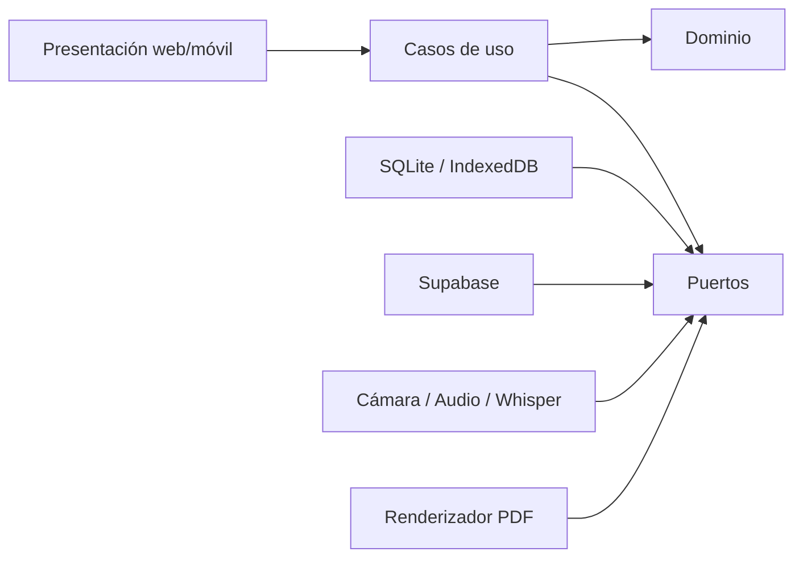

# Estado del proyecto y roadmap MVP — ArchForms

**Actualizado:** 2026-09-17  
**Estado actual:** Iteración 0.2 terminada técnicamente; falta prueba manual final del visor sincronizado y del audio prolongado.  
**Próxima iteración:** Iteración 1 — cimientos de producto, Supabase y primer corte vertical.

Este documento es la referencia operativa para continuar el desarrollo. Resume qué se decidió, qué ya existe, qué no debe rediseñarse sin evidencia nueva y cómo convertir el laboratorio actual en un MVP vendible y ampliable para un piloto con dos arquitectos.

## 1. Objetivo inmediato

Construir una aplicación funcional que dos arquitectos puedan utilizar durante inspecciones reales para:

1. crear o seleccionar un expediente;
2. crear una visita con el checklist propio del expediente;
3. completar el checklist, tomar fotos y dictar comentarios sin salir de la app;
4. conservar todo aunque no exista conexión;
5. revisar grupos, conclusiones y firmantes;
6. sincronizar el trabajo al recuperar conexión;
7. editar posteriormente desde celular o computadora;
8. generar un informe PDF con el formato de ArchForms.

El MVP debe medir reducción de tiempo y pérdida de contexto. No debe intentar resolver todavía normativa con IA, colaboración simultánea, integraciones municipales ni todos los formatos posibles.

## 2. Decisiones congeladas

### 2.1 Flujo de producto

El flujo canónico está definido en [[Contexto Demo de Informes de Visita]]. Las tres secciones de una visita —checklist, cámara/captura y resumen— existen desde el inicio y permanecen navegables. El audio delimita un grupo de fotografías y siempre se conserva junto con su transcripción.

### 2.2 Modelo de base de datos

El modelo aprobado queda **congelado para construir el MVP**. Sus fuentes canónicas son:

- [[Diseno BD Simplificado - Informes de Visita]] para jerarquía y reglas.
- `Esquema BD - Demo Informes de Visita.dbml` para la definición exacta.

Consta de nueve tablas de dominio:

1. `Profesional`
2. `Archivo`
3. `Plantilla_Checklist`
4. `Expediente`
5. `Visita`
6. `Grupo_Captura`
7. `Foto`
8. `Firmante_Visita`
9. `Adjunto`

No se deben reintroducir por anticipación tablas separadas para `Informe`, `Bloque_Informe`, `Visita_Checklist`, `Conclusiones_Visita` o historial de exportaciones. En el modelo aprobado esas relaciones son 1:1 y viven dentro de `Visita` y su `documento_json`.

Regla invariable de checklists:

```text
Plantilla_Checklist del catálogo
    └── copia JSON independiente en Expediente
            └── copia JSON independiente en cada Visita
```

No existe FK viva desde el expediente hacia la plantilla que originó su JSON. Una modificación futura del catálogo no altera expedientes, y una modificación futura del expediente no altera visitas históricas.

El esquema solo se cambiará si el piloto revela un caso real que el modelo no pueda representar. Antes de modificarlo deberá registrarse: evidencia, caso concreto, alternativa evaluada, migración y efecto sobre datos existentes.

### 2.3 Informe editable

Existe exactamente un informe por visita. `Visita.documento_json` contiene el state-tree de bloques y referencias; fotos, audios, firmas y adjuntos continúan como registros normales. Generar PDF no vuelve inmutable la visita: una edición posterior marca el PDF como desactualizado y permite regenerarlo.

### 2.4 Offline y seguridad

- La captura debe funcionar sin internet.
- Una operación se considera segura cuando está persistida localmente, no cuando solo existe en memoria.
- La sincronización será idempotente mediante outbox; reintentar no debe duplicar filas ni archivos.
- Supabase Auth identifica al profesional.
- RLS protege toda la jerarquía por propietario.
- Storage será privado.
- La aplicación cliente solo usará una clave publicable; nunca una clave secreta o `service_role`.

## 3. Estado real alcanzado

### Iteración 0.0 — contexto y definición del problema: terminada

- Se revisaron entrevistas y el dolor del ICP inicial.
- Se definió el flujo exacto de expediente → visita → captura → revisión → informe.
- Se distinguieron plantillas de checklist, checklist del expediente y respuestas de visita.
- Se analizaron tres PDF de Vicky Rosales y tres Excel de César Perales.
- Se documentaron cabeceras, checklists, grupos fotográficos, observaciones, adjuntos y firmas reales.
- Se congeló el modelo simplificado de nueve tablas.

### Iteración 0.1 — mock navegable: terminada

- Se construyó un prototipo web responsive con identidad ArchForms.
- Se representaron dashboard, expedientes, creación, visitas, captura, resumen, borrador y edición.
- El mock sirve como referencia de producto, no como fuente de arquitectura ni implementación final.

### Iteración 0.2 — laboratorio Android: implementada

Ubicación: `spikes/archforms-android-lab`.

Validado o implementado:

- Capacitor 8 y compilación Android real.
- Instalación mediante APK en el dispositivo de prueba.
- Cámara embebida: encender, apagar y capturar sin abrir la aplicación Cámara.
- Persistencia privada de fotografías.
- Grabación nativa mediante `AudioRecord` en WAV mono PCM, 16 kHz.
- Persistencia y reproducción de audios.
- Descriptores locales binarios y matching geométrico para sugerir fotos similares.
- Recuperación de metadatos después de reabrir la aplicación.
- Sincronización de la superficie nativa de cámara con el scroll y resize del WebView.

Pendiente de validación manual antes de cerrar completamente el spike:

- comprobar en el teléfono que el visor sigue exactamente su caja al hacer scroll;
- grabar, reproducir y reabrir audios de 30 segundos, 2 minutos y 10 minutos;
- repetir en modo avión y observar temperatura/memoria;
- calibrar similitud con fotografías reales de inspección;
- integrar y medir `whisper.cpp`; actualmente no existe transcripción simulada ni real;
- realizar un spike temprano de PDF con uno de los informes reales.

Commits relevantes:

- `3a75292` — prototipo responsive de ArchForms.
- `b585f6a` — laboratorio de captura offline nativa Android.
- `5e10147` — visor nativo sincronizado con scroll.

## 4. Arquitectura objetivo del MVP

El producto se construirá como un monorepo modular. La regla es reutilizar dominio y casos de uso; las pantallas, Supabase, SQLite, cámara y PDF son adaptadores reemplazables.

```text
apps/
├── web/                 React: gabinete, edición y administración
├── mobile/              React + Capacitor: trabajo de campo
└── pdf-worker/          renderizado HTML/CSS → PDF

packages/
├── domain/              entidades, value objects, invariantes y eventos
├── application/         casos de uso y puertos/interfaces
├── contracts/           esquemas JSON, DTO, validación y versiones
├── data-local/          SQLite/IndexedDB, outbox y repositorios locales
├── data-supabase/       repositorios remotos, Auth, Storage y sync
├── capture/             puertos de cámara, audio, archivos y similitud
├── document/            state-tree, bloques y comandos del editor
├── ui/                  tokens, componentes accesibles y estados comunes
└── testing/             builders, fixtures y adaptadores falsos

supabase/
├── migrations/          esquema aprobado, constraints, índices y RLS
├── seed.sql             usuario/datos de desarrollo, nunca producción
└── functions/           solo operaciones que realmente requieran servidor
```

### Capas y dependencias



El dominio no importa React, Capacitor, Supabase ni APIs del navegador. Los casos de uso dependen de interfaces, y cada plataforma proporciona adaptadores.

### Puertos reutilizables mínimos

- `AuthPort`
- `ExpedienteRepository`
- `VisitaRepository`
- `CaptureGroupRepository`
- `FileRepository`
- `SyncQueuePort`
- `CameraPort`
- `AudioRecorderPort`
- `TranscriptionPort`
- `ImageSimilarityPort`
- `DocumentRepository`
- `PdfRendererPort`
- `Clock` e `IdGenerator`

No se crearán interfaces por cada función trivial. Una abstracción se justifica cuando separa dominio de infraestructura, tiene al menos dos adaptadores previsibles, facilita una prueba importante o protege una dependencia externa.

### Casos de uso iniciales

- `CreateExpediente`
- `UpdateExpedienteChecklist`
- `CreateVisitaFromExpediente`
- `SaveChecklistAnswers`
- `CapturePendingPhoto`
- `StartCaptureGroup`
- `ConfirmCaptureGroup`
- `SaveVisitConclusions`
- `SaveDraft`
- `SynchronizePendingChanges`
- `GenerateVisitDocument`

Cada caso de uso debe ser probado sin montar React ni conectarse a Supabase.

## 5. Roadmap por iteraciones

Las iteraciones son cortes verticales demostrables. Pueden ejecutarse rápido con Astra, pero no se considera terminada una fase sin sus pruebas y criterios de salida.

### Iteración 1 — cimientos y backend reproducible

Objetivo: iniciar sesión y sincronizar una entidad real de extremo a extremo.

- Crear monorepo y paquetes base.
- Configurar TypeScript estricto, lint, tests y CI.
- Inicializar Supabase CLI y migraciones versionadas.
- Aplicar sin rediseñar el DBML aprobado.
- Crear `Profesional` asociado con `auth.users`.
- Implementar Auth por correo/contraseña.
- Implementar RLS por propietario y pruebas negativas entre dos cuentas.
- Crear Storage privado y políticas iniciales.
- Generar tipos TypeScript desde Postgres.
- Definir repositorios, `Result`, errores de dominio y contratos versionados.
- Construir AppShell, login, dashboard y estado de conexión/sync.

Salida: un usuario inicia sesión, crea un dato local y lo sincroniza; otro usuario no puede leerlo.

### Iteración 2 — expedientes, checklist y visitas

Objetivo: completar el núcleo administrativo antes de entrar a obra.

- CRUD de expedientes.
- Listado/búsqueda y dashboard de visitas pendientes.
- Catálogo de plantillas de checklist.
- Copia JSON desconectada al expediente.
- Editor básico de checklist por expediente.
- Renderer dinámico de inputs, checks, fechas y observaciones.
- Creación de visita copiando esquema y cabecera.
- Firmantes predeterminados.
- Persistencia local y sincronización de este flujo.

Salida: crear expediente y visita sin conexión, sincronizar y verlos desde web.

### Iteración 3 — captura de campo completa

Objetivo: permitir una inspección real en el celular.

- Integrar el laboratorio Android mediante `CameraPort` y `AudioRecorderPort`.
- Tres secciones persistentes y navegables.
- Checklist parcial con progreso.
- Fotos pendientes y grupos delimitados por audio.
- Confirmación/ampliación del comentario.
- Audio reproducible y texto editable.
- Conclusiones escritas o dictadas.
- Recuperación después de matar la aplicación.
- Integrar Whisper local solo después de medir el spike; el audio siempre sobrevive si falla.

Salida: completar una visita real en modo avión sin perder información.

### Iteración 4 — sincronización y medios robustos

Objetivo: trasladar de forma fiable una visita del celular a la nube y al escritorio.

- SQLite en móvil, IndexedDB cuando corresponda en web.
- Outbox con operaciones idempotentes, reintentos y backoff.
- Subidas reanudables a Storage privado.
- Checksums, estados de progreso y recuperación de fallos.
- Push/pull incremental, tombstones y política explícita de conflictos.
- Adjuntos de expediente/visita y múltiples firmantes.
- Similitud calibrada dentro de cada grupo.
- Pruebas con modo avión, cierres e interrupciones de subida.

Salida: visita completa disponible en web sin duplicados después de una red inestable.

### Iteración 5 — editor por bloques e informe PDF

Objetivo: reducir el trabajo de gabinete y producir un entregable útil.

- Inicializar `documento_json` desde la visita.
- Editor por bloques con comandos reordenables y undo/redo básico.
- Grupos multimedia, conclusiones, adjuntos y firmas.
- Selección y orden de fotos sin alterar los archivos originales.
- Preview paginado y layouts fotográficos.
- Cabecera y pie de firmas repetidos según formato.
- Render HTML/CSS → PDF en worker.
- Estado BORRADOR/GENERADO y detección de PDF desactualizado.
- Golden tests visuales contra muestras de Vicky y César.

Salida: informe PDF editable y regenerable a partir de una visita real.

### Iteración 6 — piloto cerrado con dos arquitectos

Objetivo: validar utilidad, estabilidad y disposición de pago.

- Preparar onboarding y dos cuentas separadas.
- Cargar plantillas/expedientes reales con consentimiento.
- Instrumentar eventos sin guardar audio, fotos ni texto sensible en telemetría.
- Diagnóstico exportable de errores y sincronización.
- Acompañar primeras inspecciones.
- Medir tiempo de campo, tiempo de gabinete, fotos descartadas, correcciones y fallos.
- Entrevista posterior y priorización basada en evidencia.
- Corregir bloqueadores críticos antes de ampliar el piloto.

Salida: dos arquitectos terminan informes reales y existe evidencia cuantitativa/cualitativa para decidir el siguiente producto vendible.

### Iteración 7 — MVP vendible corto plazo

Objetivo: cobrar por un flujo estable, no por una lista amplia de funciones.

- Onboarding autoservicio mínimo.
- Recuperación de cuenta y manejo de sesiones.
- Límites de plan/almacenamiento y política de retención.
- Exportación, descarga y respaldo claros.
- Observabilidad, alertas y soporte operativo.
- Privacidad, términos y consentimiento para datos sensibles.
- Release Android firmado y despliegue web estable.
- Correcciones de UX provenientes del piloto.

Salida: versión cobrable para un grupo pequeño de clientes con soporte cercano.

## 6. Estrategia para avanzar rápido sin degradar la arquitectura

1. Construir cortes verticales y evitar terminar capas aisladas durante semanas.
2. Congelar contratos de dominio por versión, no objetos internos de una librería.
3. Encapsular Capacitor, Supabase, SQLite, Whisper y PDF detrás de puertos.
4. Mantener migraciones SQL y tipos generados en Git.
5. Usar datos y formatos reales como fixtures anonimizados.
6. Probar invariantes del dominio antes que detalles visuales.
7. Evitar abstracciones especulativas y tablas “por si acaso”.
8. Registrar decisiones relevantes mediante ADR cortos.
9. Exigir estados de loading, vacío, offline, permiso denegado y recuperación de error.
10. No aceptar simulaciones silenciosas: una capacidad pendiente debe mostrarse como pendiente.

## 7. Criterio común de terminado

Una historia está terminada cuando:

- cumple el flujo acordado;
- conserva los datos después de cerrar la app;
- funciona offline cuando aplica;
- sincroniza sin duplicar;
- respeta RLS y privacidad;
- tiene pruebas de la regla crítica;
- muestra errores recuperables y estados vacíos;
- funciona en el Android objetivo y en el viewport web acordado;
- está documentada y commiteada;
- no deja contenido sensible en logs.

## 8. Próximo paso exacto

Antes de programar la Iteración 1, el propietario del proyecto debe:

1. crear o terminar de aprovisionar el proyecto Supabase;
2. habilitar Auth por email/password;
3. conservar localmente la contraseña de base de datos;
4. obtener el `project_ref`;
5. ejecutar `supabase login` personalmente;
6. confirmar si para la demo se desactiva temporalmente la verificación de correo.

Después se implementará Iteración 1 sobre el esquema congelado, empezando con migraciones, Auth/RLS y un corte mínimo de sincronización.

## 9. Fuentes de contexto relacionadas

- [[Contexto Demo de Informes de Visita]]
- [[Analisis de Formatos Reales de Informes]]
- [[Diseno BD Simplificado - Informes de Visita]]
- [[Plan Tecnico - ArchForms Funcional]]
- `spikes/archforms-android-lab/README.md`

