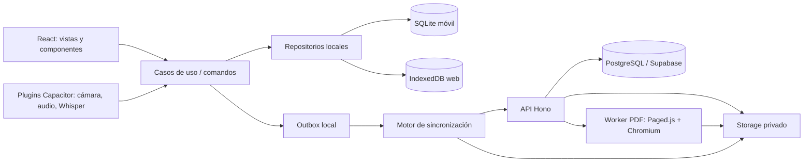

# Plan técnico — ArchForms funcional

**Fecha:** 2026-09-17  
**Estado:** propuesta de arquitectura para implementación  
**Base funcional:** [[Contexto Demo de Informes de Visita]], [[Diseno BD Simplificado - Informes de Visita]] y [[Esquema BD - Demo Informes de Visita]]

## 1. Resultado buscado

Construir una primera versión funcional de ArchForms que permita completar el flujo vertical real, sin botones decorativos ni datos que solo vivan en la interfaz:

1. El profesional inicia sesión.
2. Crea un expediente y personaliza una copia independiente de un checklist.
3. Crea una visita, incluso sin conexión.
4. Completa el checklist dinámico.
5. Toma fotografías reales.
6. Graba audio real y ve una transcripción local progresiva.
7. Confirma grupos de fotografías delimitados por cada comentario.
8. Revisa, corrige y ordena el informe por bloques.
9. Sincroniza con la nube sin perder el trabajo local.
10. Abre la misma visita desde una computadora.
11. Genera y descarga un PDF real con cabecera, checklist, fotografías, comentarios y firmas en cada hoja.

Los datos precargados para demostración pueden existir como `seed`, pero todos los formularios, botones y estados deben ejecutar el flujo real.

## 2. Decisiones sobre la propuesta tecnológica

| Capa | Decisión | Motivo |
|---|---|---|
| Lenguaje | TypeScript de extremo a extremo | Permite compartir contratos, esquemas JSON, validaciones y tipos entre cliente, API y renderizador PDF. |
| UI | React + Vite + Tailwind CSS | Se elige una sola alternativa. React encaja con el prototipo existente y con el ecosistema del editor de bloques. Tailwind se usa mediante tokens de marca, no como estilos improvisados en cada vista. |
| Componentes accesibles | Primitivas headless accesibles + componentes propios de ArchForms | Diálogos, menús, tabs y combobox no deben reconstruirse sin soporte de teclado, foco y lector de pantalla. |
| Datos de formularios | React Hook Form + Zod | El mismo esquema valida formularios en UI y comandos en el backend. El JSON dinámico del checklist usa una validación propia versionada. |
| Navegación | React Router | Cubre rutas web, navegación móvil, rutas protegidas y restauración de una visita en curso sin adoptar un framework SSR innecesario. |
| Móvil | Capacitor | Empaqueta el mismo cliente para Android/iOS y permite plugins nativos de cámara, archivos y el futuro puente con `whisper.cpp`. |
| Editor por bloques | `dnd-kit` para React | Adecuado para reordenar bloques y fotografías mediante puntero, tacto y teclado. La persistencia será nuestra, no de la librería. |
| Backend | Hono sobre Node.js | Mantiene TypeScript compartido. Se ejecutará en un contenedor porque el mismo sistema necesita Chromium para producir PDF; no se limita el proyecto a un runtime edge. |
| Plataforma de datos | Supabase: PostgreSQL + Auth + Storage privado | Reduce trabajo de autenticación, base de datos y archivos. PostgreSQL sigue siendo estándar y el esquema queda versionado en migraciones SQL. |
| Archivos | Supabase Storage con subidas reanudables | Para la primera versión evita operar Supabase y R2 al mismo tiempo. Se conserva una interfaz `ObjectStorage` para poder migrar fotografías a R2/S3 si volumen o costo lo justifican. |
| Base local móvil | SQLite nativo | Es la fuente inmediata de la UI en campo; cada cambio y su operación de salida se guardan en una misma transacción. |
| Base local web | IndexedDB | Es más natural y estable en navegador que simular SQLite entero en memoria. Comparte repositorios y contratos con SQLite, aunque no el driver físico. |
| Sincronización | Outbox local + API idempotente + cursor del servidor | Hace posible trabajar sin señal, cerrar la aplicación y continuar sin perder cambios. |
| Voz local | `whisper.cpp` nativo; WASM en web | En móvil se necesita un plugin Capacitor propio sobre las implementaciones Android/iOS. En navegador se ejecuta en un Web Worker. Siempre se guarda el audio antes de transcribir. |
| Similitud | Descriptores locales binarios tipo ORB/BRIEF + matching geométrico | Tolera mejor pequeños cambios de encuadre, giro y escala que un hash global. Solo sugiere; nunca elimina automáticamente. |
| PDF | HTML/CSS Paged Media + Paged.js + Playwright/Chromium | Paged.js pagina la vista previa y Chromium genera el archivo final reproducible en el servidor. |
| Monorepo | `pnpm` workspaces | Comparte código sin introducir desde el inicio un orquestador adicional. Se puede añadir Turborepo cuando el tiempo de compilación lo justifique. |

### Decisiones que no conviene dejar abiertas

- **React, no “React o Svelte”.** Mantener ambas posibilidades impide diseñar componentes, estado y editor concretos.
- **Hono, no Hono o FastAPI.** Python no aporta ventaja al flujo porque Whisper corre en el dispositivo; TypeScript reduce duplicación de contratos.
- **Supabase Storage primero, no R2 desde el día uno.** R2 es válido, pero un segundo proveedor añade credenciales, políticas, CORS y código de firma antes de tener usuarios reales.
- **SQLite solo en nativo e IndexedDB en web.** Ambos quedan detrás de una interfaz de repositorio. No se obliga al navegador a persistir una imagen completa de SQLite.
- **No CRDT ni colaboración simultánea en el MVP.** Se usa control optimista de versión y una pantalla explícita de conflicto. Es suficiente para una persona alternando entre celular y computadora.

## 3. Arquitectura general



### Principio offline-first

La interfaz nunca espera a la nube para registrar trabajo de campo:

1. Un caso de uso valida el comando.
2. En una transacción local actualiza el registro y agrega una operación a `_outbox`.
3. La UI lee el nuevo estado local inmediatamente.
4. El sincronizador intenta enviar operaciones cuando hay red.
5. Los binarios se suben por separado y de forma reanudable.
6. Un cursor descarga cambios confirmados por el servidor.

Así, “sin conexión” no es un modo alternativo de la aplicación: es el mismo flujo con sincronización pendiente.

## 4. Estructura del repositorio objetivo

```text
ArchVentures/
├── apps/
│   ├── client/                 # React + Vite + Capacitor
│   │   ├── src/
│   │   │   ├── app/            # Router, providers y AppShell
│   │   │   ├── features/       # expedientes, visitas, captura, editor...
│   │   │   ├── platform/       # implementaciones web/native
│   │   │   └── styles/         # tokens y estilos globales
│   │   ├── android/
│   │   └── ios/
│   ├── api/                    # Hono, autenticación, sync y archivos
│   └── worker-pdf/             # Render y exportación en Chromium
├── packages/
│   ├── contracts/              # DTO, errores y validadores Zod
│   ├── domain/                 # entidades, reglas y casos de uso puros
│   ├── data-local/             # repositorios, migraciones y outbox
│   ├── sync/                   # protocolo push/pull y resolución de estado
│   ├── report-document/        # esquema versionado de bloques
│   ├── report-renderer/        # HTML/CSS compartido por preview y PDF
│   └── ui/                     # design system ArchForms
├── supabase/
│   ├── migrations/             # SQL, constraints, índices, triggers y RLS
│   ├── tests/                  # pruebas de permisos y funciones
│   └── seed.sql
├── tests/
│   ├── e2e/
│   ├── pdf-golden/
│   └── fixtures/
└── prototipo-archforms/        # referencia visual, no código productivo
```

## 5. Base de datos: qué se conserva y qué se agrega

El modelo de nueve tablas ya definido sigue siendo el modelo de dominio:

- `Profesional`
- `Archivo`
- `Plantilla_Checklist`
- `Expediente`
- `Visita`
- `Grupo_Captura`
- `Foto`
- `Firmante_Visita`
- `Adjunto`

Se conserva la decisión importante del checklist:

```text
Plantilla_Checklist
        │ copiar JSON; no guardar FK
        ▼
Expediente.checklist_esquema_json
        │ copiar snapshot al crear visita
        ▼
Visita.checklist_esquema_json + checklist_respuestas_json
```

Cambiar una plantilla del catálogo no altera expedientes existentes. Personalizar el checklist de un expediente no altera visitas ya creadas.

### Ajustes mínimos para una aplicación funcional

La implementación inicial conserva exactamente las nueve tablas del DBML congelado. No añade entidades remotas especulativas para operaciones, cambios, exportaciones o trabajos PDF.

1. `Profesional.id` referencia `auth.users.id` y usa el mismo UUID.
2. Los constraints, índices, triggers, permisos y políticas RLS se incorporan en migraciones sin alterar el modelo conceptual.
3. La idempotencia de la primera iteración usa UUID estables y `upsert`; la cola outbox es exclusivamente local.
4. `Visita.documento_json` conserva el documento editable y `Visita.pdf_archivo_id` apunta al PDF vigente.
5. Una tabla nueva solo se evaluará después del piloto si existe evidencia de que las nueve tablas no pueden representar un requisito real.

### Tablas exclusivas del dispositivo

No se sincronizan como dominio:

| Tabla local | Función |
|---|---|
| `_outbox` | Operaciones pendientes con UUID, entidad, acción, versión base, payload e intentos. |
| `_sync_state` | Cursor descargado, última sincronización y último error. |
| `_media_queue` | Cola de fotos, audios y documentos por subir, progreso y sesión reanudable. |
| `_local_settings` | Preferencias del dispositivo, modelo Whisper disponible y permisos conocidos. |

### Reglas SQL indispensables

- RLS habilitado en todas las tablas expuestas.
- El dueño del expediente se deriva de `auth.uid()`; el acceso a visita, grupo, foto, firmante y adjunto se valida recorriendo su expediente.
- Ningún cliente recibe la clave `service_role`.
- Una foto y su grupo pertenecen a la misma visita.
- Un adjunto de visita pertenece al mismo expediente declarado.
- Los órdenes son únicos dentro de su padre.
- `documento_json`, checklist y respuestas se validan contra `schema_version` antes de aceptar el cambio.
- Los archivos se guardan en un bucket privado con ruta inmutable:

```text
{profesional_id}/{expediente_id}/{visita_id-or-general}/{archivo_id}.{extension}
```

No se sobrescribe un objeto existente; una edición genera un nuevo `Archivo`.

## 6. Contratos JSON versionados

### Checklist de expediente/visita

```ts
type ChecklistSchemaV1 = {
  schemaVersion: 1;
  sections: Array<{
    id: string;
    title: string;
    fields: Array<{
      id: string;
      type: 'checkbox' | 'text' | 'textarea' | 'number' | 'date' | 'select' | 'radio';
      label: string;
      required?: boolean;
      options?: Array<{ value: string; label: string }>;
      help?: string;
      report?: { width?: 'full' | 'half'; showIfEmpty?: boolean };
    }>;
  }>;
};
```

Las respuestas se guardan por `field.id`, nunca por posición ni por etiqueta:

```json
{
  "schemaVersion": 1,
  "values": {
    "planos_aprobados": true,
    "nivel_riesgo": "moderado",
    "observacion_planos": "Residente registra en asiento 60"
  }
}
```

### Documento editable

`Visita.documento_json` es un árbol de presentación, no una copia de fotos o audios:

```ts
type ReportDocumentV1 = {
  schemaVersion: 1;
  revision: number;
  blocks: Array<
    | { id: string; type: 'header'; locked: true }
    | { id: string; type: 'checklist'; locked: true }
    | { id: string; type: 'capture-group'; groupId: string; photoIds: string[] }
    | { id: string; type: 'text'; content: string }
    | { id: string; type: 'conclusions' }
    | { id: string; type: 'attachment'; attachmentId: string }
    | { id: string; type: 'signatures'; locked: true }
  >;
};
```

Reglas del editor:

- Cabecera, checklist y firmas siempre existen.
- Cabecera y checklist se editan mediante sus formularios fuente; el bloque solo define su posición/render.
- Los grupos pueden reordenarse y decidir qué fotos incluir.
- Se pueden añadir bloques de texto y adjuntos.
- Las firmas pueden tener imagen o reservar espacio físico.
- El documento lleva `schemaVersion` y migradores; nunca se modifica el significado de una versión ya almacenada.

## 7. Rutas de la aplicación

| Ruta | Vista y responsabilidad |
|---|---|
| `/login` | Acceso real con Supabase Auth, recuperación de sesión y descarga inicial. |
| `/` | Dashboard: visitas recientes, pendientes, sincronización y acceso rápido. |
| `/expedientes` | Buscar, filtrar y listar expedientes locales/sincronizados. |
| `/expedientes/nuevo` | Cabecera completa, selección y personalización de checklist. |
| `/expedientes/:id` | Resumen del expediente, vigencia, adjuntos y lista de visitas. |
| `/expedientes/:id/editar` | Editar cabecera y checklist que heredarán únicamente visitas futuras. |
| `/expedientes/:id/visitas/nueva` | Confirmar número/fecha y crear el snapshot de checklist/documento. |
| `/visitas/:id/campo/checklist` | Sección 1 siempre disponible. Formulario generado desde JSON. |
| `/visitas/:id/campo/captura` | Sección 2: cámara, pila pendiente, grabación y transcripción. |
| `/visitas/:id/campo/resumen` | Sección 3: grupos, similares, conclusiones, adjuntos y firmantes. |
| `/visitas/:id/editor` | Editor de bloques con orden, selección de fotos y edición de texto. |
| `/visitas/:id/preview` | Páginas A4 renderizadas con el mismo motor visual del PDF. |
| `/visitas/:id/exportaciones` | Estado, historial y descarga de PDF generado. |
| `/plantillas` | Catálogo de plantillas propias y de plataforma. |
| `/perfil` | Datos, colegiatura, cargo y firma predeterminada. |
| `/sincronizacion` | Cola, progreso, errores recuperables y reintentos. |

En móvil, las tres rutas `/campo/*` se muestran como tabs persistentes. Cambiar de sección no finaliza la visita ni descarta nada.

## 8. API del backend

La autenticación se realiza con Supabase Auth. La API recibe el JWT del usuario y no crea un segundo sistema de sesiones.

### Salud e inicio

| Método | Ruta | Uso |
|---|---|---|
| `GET` | `/health` | Estado básico del servicio y versión desplegada. |
| `GET` | `/v1/bootstrap` | Perfil, plantillas disponibles, datos del usuario y cursor inicial. |

### Sincronización

| Método | Ruta | Uso |
|---|---|---|
| `POST` | `/v1/sync/push` | Aplica un lote ordenado de operaciones idempotentes. Devuelve confirmaciones, versiones nuevas y conflictos. |
| `GET` | `/v1/sync/pull?cursor=...&limit=...` | Devuelve cambios posteriores al cursor, incluidos tombstones. |

Ejemplo de una operación:

```json
{
  "operationId": "0199...",
  "entity": "grupo_captura",
  "entityId": "0199...",
  "action": "upsert",
  "baseVersion": 3,
  "payload": { "estado": "CONFIRMADO", "comentario_editado": "..." }
}
```

El servidor responde por operación con `applied`, `already_applied`, `conflict` o `rejected`. Un reintento con el mismo `operationId` devuelve el resultado anterior.

No se crea en paralelo una API CRUD completa para cada pantalla. Todos los cambios de dominio usan el mismo protocolo de sincronización, tanto en línea como offline; esto evita mantener dos comportamientos diferentes.

### Archivos

| Método | Ruta | Uso |
|---|---|---|
| `POST` | `/v1/files/:id/upload-session` | Autoriza ruta, MIME, tamaño y crea una sesión de subida privada/reanudable. |
| `POST` | `/v1/files/:id/complete` | Verifica objeto/checksum y marca `Archivo` como sincronizado. |
| `GET` | `/v1/files/:id/access-url` | Devuelve acceso temporal a un archivo que el usuario puede consultar. |

El audio o la foto no atraviesan el proceso de Hono byte por byte. El cliente sube directamente a Storage con la autorización limitada recibida.

### PDF

| Método | Ruta | Uso |
|---|---|---|
| `POST` | `/v1/visitas/:id/exportaciones` | Congela el snapshot, crea un trabajo idempotente y devuelve `202`. |
| `GET` | `/v1/exportaciones/:id` | Estado `PENDIENTE`, `PROCESANDO`, `LISTA` o `ERROR`. |
| `GET` | `/v1/exportaciones/:id/descarga` | URL temporal del PDF autorizado. |

El trabajo de PDF:

1. Lee un snapshot coherente del expediente, visita, grupos, fotos y firmantes.
2. Valida `documento_json`.
3. Renderiza HTML con el paquete compartido `report-renderer`.
4. Paged.js calcula páginas, cortes y elementos repetidos.
5. Playwright imprime PDF A4 con fondos y tamaño CSS.
6. Se guarda el PDF como objeto privado y se registra checksum/versión.

## 9. Componentes dinámicos

### Estructura y navegación

- `AppShell`: sidebar en escritorio y navegación inferior en móvil.
- `TopBar`: contexto actual, conectividad, estado de sincronización y usuario.
- `OfflineBanner`: indica que el trabajo está seguro localmente, no solo que “no hay internet”.
- `SyncStatusButton`: pendientes, subidas en curso, último éxito y errores accionables.
- `RouteGuard`: sesión, expediente/visita existente y permisos.

### Expedientes

- `ExpedienteList` y `ExpedienteCard`.
- `ExpedienteForm` dividido en datos principales, licencia/vigencia, obra, responsable, póliza y campos extra.
- `ChecklistTemplatePicker`.
- `ChecklistSchemaEditor`: añadir, renombrar, ordenar o eliminar campos sobre la copia del expediente.
- `VisitList` y `CreateVisitDialog`.

### Visita en campo

- `VisitFieldLayout`: tabs Checklist / Captura / Resumen siempre disponibles.
- `DynamicChecklist`: renderer por tipo de campo y progreso real.
- `CameraCapture`: captura real y permisos; muestra el resultado guardado localmente.
- `PendingPhotoRail`: fotos aún no delimitadas por comentario.
- `AudioRecorder`: estado, duración, pausa/continuación si la plataforma lo permite y archivo ya persistido.
- `LiveTranscript`: parciales del worker/plugin y texto final corregible.
- `ConfirmCaptureGroup`: check durante cinco segundos y acción “continuar grabando”; nunca borra por accidente.
- `CaptureGroupCard`: comentario, reproductor, fotos y selección.
- `SimilarPhotoSuggestion`: agrupa visualmente candidatos y pide al usuario cuáles incluir.
- `ConclusionsEditor`: texto o audio real.
- `SignerEditor`: dos o más firmantes, imagen opcional y preview de espacio físico.

### Editor e informe

- `ReportBlockCanvas`: lista ordenada y accesible.
- `ReportBlockToolbar`: añadir texto/adjunto y mover bloques.
- `HeaderBlock`, `ChecklistBlock`, `CaptureGroupBlock`, `TextBlock`, `ConclusionsBlock`, `AttachmentBlock`, `SignaturesBlock`.
- `PhotoLayoutEditor`: orden, selección y alternativas de rejilla sin deformar la relación de aspecto.
- `PagedPreview`: páginas reales, no una tarjeta aproximada.
- `DraftActions`: guardar, previsualizar, generar y señalar que el PDF anterior quedó desactualizado.
- `ExportStatus`: progreso, error, reintento y descarga.

Todos los componentes ejecutan casos de uso; ninguno llama directamente a SQLite, IndexedDB, Supabase o `fetch`.

## 10. Flujos técnicos críticos

### Crear expediente

1. Se completa `ExpedienteForm`.
2. Al escoger una plantilla se copia su nombre y JSON al borrador local.
3. `ChecklistSchemaEditor` modifica únicamente esa copia.
4. Guardar crea `Expediente` y su operación de outbox en una transacción.
5. La pantalla del expediente aparece de inmediato; el badge indica si falta sincronizar.

### Crear visita

1. Se valida número único dentro del expediente.
2. Se copian nombre y esquema del checklist del expediente.
3. Se crea `checklist_respuestas_json` vacío.
4. Se genera el documento mínimo con cabecera, checklist, conclusiones y firmas.
5. Se crean los firmantes predeterminados configurados.
6. Se abre `/campo/checklist`.

### Capturar fotos y comentario

1. Cada fotografía se escribe primero en el almacenamiento privado del dispositivo.
2. Se calcula checksum y un conjunto de descriptores locales una vez normalizada la orientación EXIF.
3. Se crea `Archivo` + `Foto(grupo_captura_id = null)` localmente.
4. Al grabar, el archivo de audio se abre/persiste antes de iniciar inferencia.
5. Whisper procesa fragmentos en segundo plano y publica texto parcial.
6. Al detener, se hace una pasada final; la transcripción sigue siendo editable.
7. Confirmar crea/cierra `Grupo_Captura` y asigna todas las fotos pendientes actuales en una transacción.
8. La cámara permanece abierta para iniciar el grupo siguiente.

Si Whisper falla o el dispositivo no soporta el modelo, el audio y las fotos siguen intactos; la visita puede continuar y reintentar la transcripción local más tarde.

El spike validó que abrir la aplicación Cámara rompe el ritmo de campo. La implementación usa `CameraPreviewPort` con vista nativa continua, controles de encendido/apagado y disparador dentro de ArchForms.

### Similitud de fotos

1. Se comparan solo fotos del mismo grupo.
2. El matching por Hamming entre descriptores binarios produce candidatos y una comprobación geométrica descarta coincidencias aisladas.
3. Se muestran pares o conjuntos parecidos.
4. El usuario cambia `seleccionada_para_informe`; ningún archivo se elimina.
5. Los umbrales se calibran con las fotografías reales de las inspecciones, no con un valor asumido.

### Sincronizar

1. Se refresca la sesión si es necesario.
2. Se empujan metadatos pequeños respetando dependencias.
3. Se crean/reanudan subidas de medios.
4. Se confirma cada objeto al terminar.
5. Se vacían operaciones aceptadas.
6. Se descargan cambios posteriores al cursor.
7. Un conflicto de versión no se sobrescribe silenciosamente: se conserva la copia local y se pide elegir/combinar.

### Editar en computadora

1. Tras iniciar sesión, `bootstrap/pull` hidrata IndexedDB.
2. El editor consulta la misma capa de repositorios.
3. Las URLs de medios se obtienen de manera temporal y autorizada.
4. Editar un bloque incrementa la revisión local y marca el PDF anterior como desactualizado.
5. El cambio entra al mismo outbox que en móvil.

## 11. Voz a texto: diseño realista

La promesa de producto debe ser **transcripción local progresiva**, no “latencia cero en cualquier equipo”.

### Móvil

- Plugin Capacitor propio con una API estable:

```ts
interface LocalTranscriptionPort {
  isSupported(): Promise<boolean>;
  ensureModel(model: 'tiny' | 'base'): Promise<ModelStatus>;
  start(options: { language: 'es'; audioSessionId: string }): Promise<void>;
  onPartial(listener: (text: string) => void): Unsubscribe;
  stop(): Promise<{ text: string; timings: Segment[] }>;
  cancelInference(): Promise<void>;
}
```

- iOS usa la integración C/C++ de `whisper.cpp` mediante Swift/Objective-C++.
- Android usa JNI/CMake desde Kotlin.
- El modelo se descarga una vez con checksum, Wi-Fi recomendado y progreso visible.
- La inferencia nunca comparte el hilo de UI.

### Web

- WASM en Web Worker con SIMD cuando esté disponible.
- Feature detection y medición inicial del equipo.
- Si no alcanza rendimiento aceptable, se conserva el audio y se ofrece transcribir después en ese mismo equipo; no se envía audio a un servicio externo sin consentimiento y una decisión de producto posterior.

### Spike obligatorio

Antes de construir todo el flujo se debe probar en los teléfonos reales de los inspectores:

- 10 minutos continuos de audio en español técnico.
- Pantalla/cámara activa y consumo térmico.
- Tiempo hasta primer parcial y tiempo de cierre final.
- Memoria, tamaño del modelo y reinicio de app.
- Exactitud en nombres, medidas y términos de obra.

El resultado decide entre modelo `tiny`, `base`, fragmentos de distinta duración o transcripción diferida. No se debe diseñar la promesa comercial antes de esta prueba.

## 12. PDF y firmas

Se mantiene una sola implementación declarativa de informe:

```text
ReportDocument + datos de dominio
              │
              ▼
      report-renderer (React/HTML/CSS)
          │                    │
          ▼                    ▼
 preview en cliente       Chromium en worker
                               │
                               ▼
                           PDF generado
```

Reglas de render:

- A4 y márgenes fijos por versión de formato.
- Cabecera de visita repetible donde corresponda.
- Pie de firmas reservado en todas las hojas.
- Dos, tres o más firmantes distribuidos sin cortar nombre/cargo.
- Si `firma_archivo_id` es nulo, deja un espacio real para firma física.
- Fotografías usan `object-fit: contain`; nunca se deforman ni recortan evidencia sin decisión explícita.
- El algoritmo prueba rejillas permitidas y elige la que aprovecha página sin separar innecesariamente comentario y grupo.
- Checklist y tablas no cortan una fila entre páginas.
- Cada exportación registra documento/revisión, archivos usados y checksum.

## 13. Seguridad, privacidad y recuperación

- Auth real con correo/enlace o correo/contraseña; MFA puede añadirse después.
- RLS y grants mínimos en PostgreSQL y Storage.
- Buckets privados; URLs temporales, no públicas.
- Firma, audio y fotografías se consideran datos sensibles.
- Claves locales móviles en Keychain/Keystore; SQLite cifrado si el plugin y la distribución quedan validados.
- Tokens nunca se guardan en logs ni en `localStorage` plano si existe almacenamiento seguro nativo.
- Al cerrar sesión se pregunta antes de borrar trabajo local pendiente.
- Telemetría técnica no incluye transcripciones, imágenes ni contenido del informe.
- Backups de base de datos y una política separada para respaldar objetos; un backup de PostgreSQL no implica backup de Storage.
- Exportación y eliminación de datos por usuario deben diseñarse antes de un piloto público.

## 14. Estrategia de pruebas

| Nivel | Qué debe cubrir |
|---|---|
| Unitarias | reglas de checklist, agrupación, orden, selección, documento y conflictos. |
| Contratos | cada payload API contra Zod y compatibilidad entre versiones. |
| Repositorios | misma batería de comportamiento para SQLite e IndexedDB. |
| Integración DB | migraciones desde cero, constraints, funciones, triggers y RLS por usuario. |
| Componentes | checklist dinámico, editor, permisos, estados vacíos/error/offline. |
| E2E web | expediente → visita → edición → PDF con servicios reales locales. |
| E2E móvil | cámara, micrófono, cierre forzado, reapertura, modo avión y reconexión. |
| PDF golden | comparación visual de formatos de Vicky/César, saltos y firmas por página. |
| Rendimiento | 100+ fotos por visita, audios largos, listas grandes y dispositivos de gama media. |

### Pruebas de aceptación del prototipo funcional

1. Completar una visita entera en modo avión, cerrar la app y recuperar todo al abrirla.
2. Volver a tener red y ver expediente, visita, fotos y audios en escritorio.
3. Interrumpir una subida y reanudarla sin duplicar registros u objetos.
4. Forzar un fallo de Whisper y demostrar que el audio se conserva.
5. Modificar el checklist del expediente y comprobar que una visita anterior no cambia.
6. Detectar fotos parecidas sin eliminarlas.
7. Editar comentario, orden y selección de fotos desde el editor.
8. Generar PDF con checklist, grupos y firmas repetidas correctamente.
9. Editar después de generar y mostrar claramente que el PDF quedó desactualizado.
10. Intentar acceder al expediente de otro usuario y recibir denegación en DB y Storage.

## 15. Plan por iteraciones

### Iteración 0 — spikes que eliminan incertidumbre

- Probar `whisper.cpp` en Android/iOS reales.
- Capturar foto/audio, persistir y sobrevivir reinicio.
- Renderizar dos informes reales completos con Paged.js/Chromium.
- Validar descriptores locales con las fotos de las muestras y calibrar el umbral por dispositivo.
- Decidir límites concretos: modelo, formatos de audio/imagen y tamaño máximo.

**Salida:** decisiones medidas; ningún flujo simulado.

### Iteración 1 — cimientos

- Monorepo, CI, lint, tests y entornos.
- Design system y layout responsive a partir del mock.
- Supabase local, migraciones SQL, Auth y RLS.
- Repositorios SQLite/IndexedDB, outbox y contratos.
- AppShell, login, dashboard y estado de sincronización.

**Salida:** un usuario inicia sesión y un registro local se sincroniza de extremo a extremo.

### Iteración 2 — expedientes y checklists

- CRUD real de expediente.
- Catálogo y copia independiente de plantilla.
- Editor básico de esquema del expediente.
- Renderer dinámico de campos.
- Creación de visita con snapshots y firmantes predeterminados.

**Salida:** crear expediente/visita offline y verla después en otro dispositivo.

### Iteración 3 — trabajo de campo

- Tabs persistentes de las tres secciones.
- Checklist real y progreso.
- Cámara, pila pendiente y almacenamiento local.
- Grabación, reproducción y plugin Whisper.
- Confirmación atómica de grupos y conclusiones.

**Salida:** una inspección real completa sin conexión.

### Iteración 4 — medios y sincronización robusta

- Storage privado, subida reanudable y checksums.
- Push/pull idempotente, tombstones y conflictos.
- Descriptores locales, sugerencias y selección para informe.
- Adjuntos, póliza/cuaderno y múltiples firmantes.
- Pruebas de interrupción, reinicio y red inestable.

**Salida:** traslado fiable celular → nube → escritorio.

### Iteración 5 — editor y PDF

- Documento por bloques versionado.
- Reordenamiento táctil/teclado y layouts fotográficos.
- Preview paginado.
- Worker de PDF, historial y descarga.
- Pie de firmas en cada página y formatos calibrados con muestras reales.

**Salida:** PDF válido generado a partir de una visita real.

### Iteración 6 — piloto

- Accesibilidad y responsive final.
- Telemetría sin contenido sensible y diagnóstico de sync.
- Rendimiento, consumo y errores recuperables.
- Piloto acompañado con los dos inspectores.
- Correcciones basadas en tiempo real ahorrado y fallos observados.

**Salida:** versión candidata para demostrar el problema y la solución en una inspección real.

## 16. Orden recomendado del primer corte vertical

No conviene terminar módulos aislados. El primer corte debe recorrer el producto entero con el mínimo de cada pieza:

```text
Login
  → crear expediente con checklist
  → crear visita
  → completar dos checks
  → tomar dos fotos
  → grabar/transcribir un comentario
  → confirmar grupo
  → sincronizar
  → abrir en web
  → generar un PDF de una página
```

Después se profundiza cada parte. Este corte revela pronto incompatibilidades entre cámara, almacenamiento local, sync, bloques y PDF.

## 17. Fuera del primer prototipo funcional

- Edición colaborativa simultánea en tiempo real.
- IA generativa para redactar conclusiones.
- Reconocimiento semántico de patologías o elementos constructivos.
- OCR automático de pólizas/planos/cuaderno.
- Exportación DOCX.
- Integración con municipalidades o firma digital certificada.
- Marketplace de plantillas.
- Migración a R2/S3 antes de medir el consumo real.

Estas funciones pueden construirse sobre la arquitectura propuesta, pero incluirlas ahora debilitaría el flujo central que se quiere validar.

## 18. Criterio de “terminado”

Una historia no está terminada solo porque la pantalla se ve como el mock. Debe:

- persistir localmente;
- funcionar sin red cuando corresponda;
- reabrirse tras matar la app;
- sincronizar de forma idempotente;
- respetar autorización;
- mostrar carga, vacío, permiso denegado y error recuperable;
- tener pruebas de la regla crítica;
- funcionar con teclado/táctil según la plataforma;
- no perder audio, foto o texto ante un fallo de una etapa posterior.

## 19. Referencias técnicas oficiales verificadas

- [React](https://react.dev/)
- [Tailwind CSS: responsive design](https://tailwindcss.com/docs/responsive-design)
- [Capacitor](https://capacitorjs.com/docs)
- [Capacitor Camera](https://capacitorjs.com/docs/apis/camera)
- [Capacitor Filesystem](https://capacitorjs.com/docs/apis/filesystem)
- [dnd-kit React](https://dndkit.com/react/quickstart/)
- [whisper.cpp](https://github.com/ggml-org/whisper.cpp)
- [whisper.cpp WebAssembly](https://github.com/ggml-org/whisper.cpp/blob/master/examples/whisper.wasm/README.md)
- [Supabase Database](https://supabase.com/docs/guides/database/overview)
- [Supabase Row Level Security](https://supabase.com/docs/guides/database/postgres/row-level-security)
- [Supabase Storage](https://supabase.com/docs/guides/storage)
- [Supabase resumable uploads](https://supabase.com/docs/guides/storage/uploads/resumable-uploads)
- [Supabase migrations](https://supabase.com/docs/guides/local-development/database-migrations)
- [Hono on Node.js](https://hono.dev/docs/getting-started/nodejs)
- [Hono validation](https://hono.dev/docs/guides/validation)
- [Paged.js](https://pagedjs.org/devdocs/)
- [Playwright `page.pdf()`](https://playwright.dev/docs/api/class-page#page-pdf)
