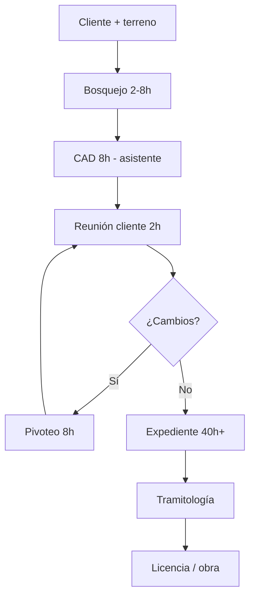

# Customer Journey Map — Arquitecto Proyectista

**Estado:** ✅ Validado (n=5: César, Miguel Luna, Daniel, Flores, Israel).

---

## Journey Map (flujo típico vivienda/edificio)

| # | Etapa | Qué hace | Tiempo típico | Herramientas | Dolor |
|:---:|:---|:---|:---|:---|:---|
| 1 | **Captación** | Conocer cliente, necesidad, terreno | 1–2 reuniones | — | Bajo |
| 2 | **Insumos** | Topografía, normativa, linderos, programa | Días–semanas | PDF, municipalidad | Medio |
| 3 | **Ideación** | Bosquejo a mano alzada / 3D mental | 2h–8h | Papel, mente | Bajo (valor creativo) |
| 4 | **Propuesta CAD** | Pasar bosquejo a AutoCAD (delega a asistente) | 8h | AutoCAD, SketchUp | **Alto** (mecánico) |
| 5 | **Reunión cliente** | Presentar, recibir cambios | 2h | CAD, reunión | Medio |
| 6 | **Pivoteo** | Cambio "pequeño" → reproporcionar todo | **8h–1 día** | CAD | **Muy alto** |
| 7 | **Expediente municipal** | Planos, cortes, elevaciones, FUE, memorias | **40h–5 meses** | AutoCAD, Excel, Word | **Muy alto** |
| 8 | **Tramitología** | Firmas, gestión municipal, esperas | Semanas | Físico | Medio (no neto) |
| 9 | **Ejecución** | Supervisión obra (si aplica) | Continuo | — | Variable |

---

## Estadísticas de dolores (proyectista)

| Micro-dolor | Menciones | % del tiempo (cuando citado) | Intensidad |
|:---|:---:|:---:|:---:|
| Elaboración gráfica de planos (expediente) | 3/5 | 80–95% del expediente | 🔴 |
| Pivoteo / cambios cliente | 2/5 | 8h por cambio | 🔴 |
| Error humano FUE / formularios | 1/5 | 5% expediente pero causa rechazo | 🟠 |
| Coordinación con especialistas | 1/5 | No cuantificado | 🟠 |
| Metrados y presupuestos | 1/5 | Mecánico principal (junior) | 🟠 |
| Control de versiones / chancar archivos | 1/5 | Catastrófico cuando ocurre | 🟡 |
| Memorias descriptivas | 1/5 | Ya resuelto con IA (Miguel) | 🟢 |
| Renders 3D | 1/5 | Ya resuelto (SketchUp+IA) | 🟢 |

### Tiempos citados
| Fuente | Métrica | Valor |
|:---|:---|:---|
| César Perales | Expediente municipal neto | 40h (1 semana) |
| César Perales | Cambio post-reunión | 8h |
| César Perales | Bosquejo → CAD | 8h |
| Daniel Nuñez | Expediente completo (equipo 3) | 5 meses, 6h/día |
| Miguel Luna | Expediente según magnitud | 3–8 meses |

---

## Capa 2: Gestión multi-proyecto (CRÍTICO)

| Señal | Fuente | Detalle |
|:---|:---|:---|
| No sigue su propio pipeline óptimo | César (transcripcion.txt) | "En teoría sí, pero no lo continúo consensuadamente" |
| 10+ proyectos en paralelo | César | Se pierde por huecos de espera del cliente |
| No sabe en qué etapa retomó | César | Necesitaría diagrama de flujo + checkpoint |
| Módulo BFS de apuntes | Madre (transcripcion.txt) | Sistema personal para no perder contexto entre tareas |
| Múltiples proyectos + tramitología | Daniel | Equipo de 3 para paralelizar |

**Insight:** Para proyectistas, el producto no es "IA en CAD" sino un **tablero de estado por proyecto** ("Proyecto A: esperando firma cliente", "Proyecto B: en expediente 60%").

---

## Willingness to pay (proyectista)
- **Bajo** para herramientas puntuales — ya usan IA gratis (memorias), tienen asistentes.
- **Medio** si bundle ahorra 40h de expediente.
- **No son ICP actual** para MVP de inspección/reportes.

---

## Entrevistas vinculadas
- [[Entrevista - Cesar Andres Perales]]
- [[Entrevista - Miguel Luna]]
- [[Entrevista - Daniel Nuñez]]
- [[Entrevista - Flores]] (metrados)
- [[Entrevista - Israel]] (coordinación)

## Próximas preguntas
Ver [[Arquitecto Proyectista]] sección "Preguntas de seguimiento".
