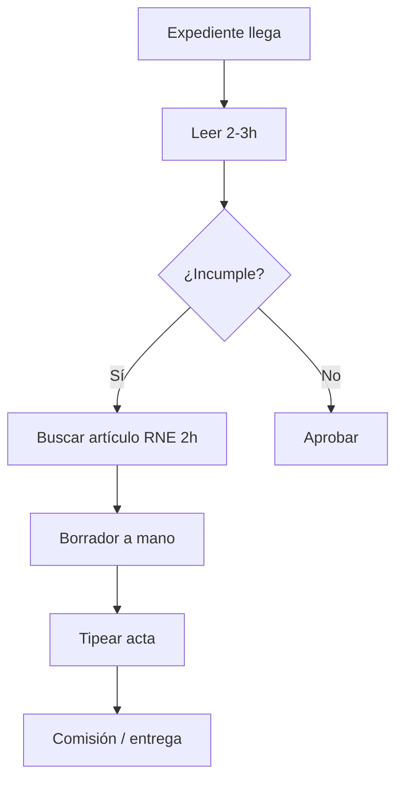

# Customer Journey Map — Delegado CAP

**Estado:** ✅ Validado parcialmente (n=2: Vicky Rosales, transcripcion.txt / madre delegada).

---

## Journey Map

| # | Etapa | Qué hace | Tiempo | Herramientas | Dolor |
|:---:|:---|:---|:---|:---|:---|
| 1 | **Recepción expediente** | Recibe planos + memorias (físico o PDF) | — | Papel, PDF | Bajo |
| 2 | **Lectura/comprensión** | Entender proyecto complejo, cruzar memoria vs. planos | 2–3h | Ojo, regla | Medio |
| 3 | **Detección fallas** | Identificar incumplimientos (medidas, normativa) | Durante lectura | Experiencia, intuición | Medio |
| 4 | **Justificación normativa** | Buscar artículo exacto del RNE para cada observación | **~2h** (madre) | PDF RNE, índice Excel manual | **Muy alto** |
| 5 | **Redacción acta** | Escribir observaciones a mano (borrador) | 30min–1h | Papel | Medio |
| 6 | **Digitalización** | Pasar a limpio (asistente tipea o él mismo) | 20min (con asistente) | Word | Bajo si hay asistente |
| 7 | **Entrega** | Presentar acta en comisión municipal | — | Impreso | Bajo |

---

## Estadísticas de dolores

| Micro-dolor | Menciones | Intensidad | Problema ArchVentures |
|:---|:---:|:---:|:---|
| Búsqueda lineal normativa (RNE) | 2/2 | 🔴 Alta | P1 |
| Redacción repetitiva de actas | 2/2 | 🟠 Media | P6 |
| Memorias contradictorias con planos | 1/2 | 🟡 Baja | Fuera MVP |
| Dependencia de asistente para tipear | 1/2 | 🟡 Contextual | Oportunidad B2B municipal |

### Insight clave (transcripcion.txt)
La madre delegada inventó un **índice invertido en Excel** (5 hojas) para buscar artículos del RNE sin pensar — validación de que el dolor normativo es tan real que lo resolvieron con trabajo manual creativo.

---

## Variante: Revisor Urbano vs. Delegado CAP
| Aspecto | Revisor Urbano (Vicky) | Delegado CAP (comisión) |
|:---|:---|:---|
| Trabajo | Solo, más estrés | En comisión de 3, discuten dudas |
| Responsabilidad | Alta (ambigüedad normativa) | Compartida |

---

## Entrevistas vinculadas
- [[Entrevista - Vicky Rosales]] (sección Delegada CAP)
- `transcripcion.txt` (madre delegada — búsqueda normativa, actas)

## Próximas preguntas
Ver [[Delegado CAP]] sección "Preguntas de seguimiento".
