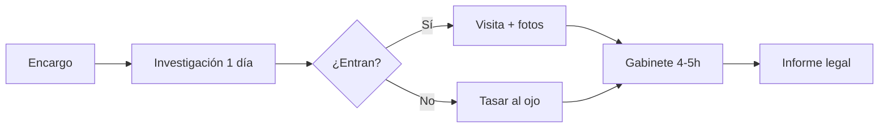

# Customer Journey Map — Perito Técnico

**Estado:** ✅ Validado parcialmente (n=2: Vicky Rosales, transcripcion.txt / madre perito).

---

## Journey Map

| # | Etapa | Qué hace | Tiempo | Herramientas | Dolor |
|:---:|:---|:---|:---|:---|:---|
| 1 | **Recepción encargo** | Orden judicial / demanda, sin expediente completo | — | Email, físico | Bajo |
| 2 | **Investigación documental** | Copia Literal SUNARP, SUNAT, zonificación, historial satélite año×año | **1 día entero** | Web, Google Earth, portales | **Muy alto** |
| 3 | **Visita (si permiten)** | Inspección visual, fotos (hasta 1000), categorización | 2–4h | Celular, libreta | Medio-alto |
| 4 | **Visita restringida** | Tasar "al ojo" por fachada (90% embargos) | — | Experiencia | Alto (incertidumbre) |
| 5 | **Gabinete mecánico** | Organizar fotos, describir, llenar formato Word estructurado | 4–5h | Word, Excel | **Muy alto** |
| 6 | **Cálculo valuación** | Metrados, precios (a veces delega a ingeniero) | Variable | Excel | Medio |
| 7 | **Entrega pericial** | Informe final con validez legal | — | PDF | Bajo |

---

## Estadísticas de dolores

| Micro-dolor | Menciones | Intensidad | Problema ArchVentures |
|:---|:---:|:---:|:---|
| Extracción datos históricos (SUNARP, satélite) | 2/2 | 🔴 Alta | P5 |
| Redacción mecánica + fotos en informe | 2/2 | 🔴 Alta | P6 |
| Búsqueda normativa / justificación | 1/2 | 🟠 Media | P1 |
| No poder entrar al inmueble | 1/2 | 🟡 Contextual | Fuera MVP |
| Homologación de precios (ingeniero) | 1/2 | 🟡 Delegado | Fuera MVP |

### Patrón de flujo (transcripcion.txt)
1. Va a obra → toma notas/fotos/graba
2. Vuelve a casa → investiga, investiga, investiga
3. Llena índice/formato Word
4. **El valor real está en la visita; el 80% del tiempo es mecánico en gabinete**

---

## Entrevistas vinculadas
- [[Entrevista - Vicky Rosales]] (sección Perito Judicial)
- `transcripcion.txt` (madre perito — investigación satélite, fotos, gabinete)

## Próximas preguntas
Ver [[Perito Tecnico]] sección "Preguntas de seguimiento".
